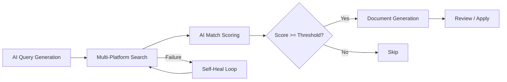
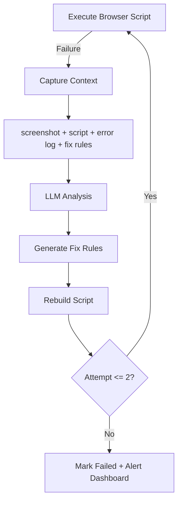

# Web3ToolBox — AI Agent Runtime Platform

> A desktop platform that provides browser execution, persistent memory, and shared tool capabilities for AI agents. Agents connect via a standard WebSocket protocol and operate real fingerprint browsers to automate complex web workflows.

## Quick Start

### 1. Download

Go to the [Releases page](https://github.com/web3ToolBoxDev/toolBoxClient/releases) and download the latest installer (`web3toolbox Setup x.x.x.exe` for Windows).

### 2. Install

Run the downloaded installer and follow the on-screen prompts. The app installs to your system like any standard desktop application.

### 3. First Launch

When you open Web3ToolBox for the first time:

1. **Wait for initialization** — The app will automatically install internal dependencies (first launch only; a progress bar is shown). Once ready, the main UI loads.
2. **Introduction page** — You'll land on the Introduction page with links to the video guide, GitHub, and Twitter/X.

### 4. Initial Setup (Chrome Manager)

Navigate to **Chrome Manager** in the sidebar:

1. **Install Browser** — Click the install button to download the customized Chromium browser with fingerprint capabilities. This is required for all browser-based automation.
2. **Set Save Path** — Choose a directory where the app stores all your data (fingerprints, wallets, agent sessions, search history). This must be set before using any features.

### 5. Prerequisites for Job Seek Agent

Before using the Job Seek AI Agent, you need **one** of the following AI providers installed and authenticated on your machine:

| Provider | Install | Login |
|----------|---------|-------|
| **Claude Code** (recommended) | `npm install -g @anthropic-ai/claude-code` | Run `claude` in terminal and complete authentication |
| **Codex CLI** | `npm install -g @openai/codex` | Run `codex` in terminal and complete authentication |
| **API Key** | No installation needed | Enter your OpenAI or Anthropic API key directly in the Agent Workspace settings |

> **Tip:** The app auto-detects installed CLI tools. If both are present, Codex CLI is tried first, then Claude Code. You can also manually select a provider in the workspace.

### 6. Launch Job Seek Agent

1. Click **AI Agents** in the sidebar
2. Click **Open Workspace** on the Job Seek AI Assistant card
3. **Create a session** — Give your job search a name
4. **Complete onboarding** — Answer the guided questions:
   - Target job title
   - Preferred location
   - Work mode (Remote / Hybrid / Onsite / Any)
   - Target salary (optional)
   - Upload resume (optional — PDF, DOC, or image)
5. Click **Start** — The agent initializes your session

### 7. Dashboard Setup

After onboarding, click the **Dashboard** tab to access the job search control panel:

1. **Login to job platforms** — Click the login button for **LinkedIn** and/or **Indeed**. A fingerprint browser window will open for each platform. Log in with your credentials manually, then close the browser window. The platform card will show a green "Logged In" status.
2. **Build Search Tool** — Click **Build** on each platform card. The AI will generate a custom search script tailored to the platform's current page structure. Wait for the build to complete (status changes to "Ready").
3. **Start Workflow** — Click the **Start Workflow** button. The AI agent will begin the automated pipeline: generating search queries, searching across platforms, scoring job matches, and producing tailored resumes and cover letters for high-scoring positions.

> **Note:** You must be logged in and have a built search tool for at least one platform before starting the workflow. The dashboard shows real-time progress, job listings, match scores, and generated documents as the workflow runs.

## Video Demo

[](https://youtu.be/1hM0i_aTNdM)

> Click the image above to watch the full usage walkthrough on YouTube.

## Platform Architecture

```
┌──────────────────────────────────────────────────────────────┐
│                    AI Agents (WebSocket Protocol)             │
│  ┌─────────────────────┐  ┌─────────────────────┐           │
│  │   Job Seek Agent    │  │   Future Agent...   │           │
│  │ Search·Match·Gen    │  │                     │           │
│  └─────────┬───────────┘  └─────────┬───────────┘           │
└────────────┼────────────────────────┼────────────────────────┘
             │ WebSocket Protocol     │
┌────────────▼────────────────────────▼────────────────────────┐
│                  ToolBox Platform (Electron)                  │
│                                                              │
│  ┌────────────────────────────────────────────────────────┐  │
│  │  Core Services                                         │  │
│  │  Express Backend (:30001) ─ Task Lifecycle · WS Hub    │  │
│  │  React Frontend  (:3000)  ─ Agent Workspace · Dashboard│  │
│  └────────────────────────────────────────────────────────┘  │
│                                                              │
│  ┌──────────────────┐ ┌──────────────────┐ ┌──────────────┐ │
│  │  Tool Service    │ │  Memory Layer    │ │  Browser     │ │
│  │  (:30004)        │ │  (:30002)        │ │  Runtime     │ │
│  │  Browser Pool    │ │  SQLite (SoT)    │ │  Chromium    │ │
│  │  Wallet Tools    │ │  mem0 (Semantic) │ │  C++ Patches │ │
│  │  Email · Registry│ │  Scope Isolation │ │  Fingerprint │ │
│  └──────────────────┘ └──────────────────┘ └──────────────┘ │
│  ┌──────────────────────────────────────────────────────┐   │
│  │  StateService (Unified State Management)              │   │
│  │  EventBus · StateStore · Persistence · Agent Bridge   │   │
│  └──────────────────────────────────────────────────────┘   │
└──────────────────────────────────────────────────────────────┘
```

The platform separates **infrastructure** from **application logic**. Each AI agent is a standalone Node.js process that connects to the platform via a [standardized WebSocket protocol](docs/ai-agent-protocol.md). The platform provides three foundational layers:

| Layer | Responsibility | Implementation |
|-------|---------------|----------------|
| **Browser Runtime** | Execute automation in real, fingerprint-consistent browsers | Customized Chromium with C++ Blink patches, per-environment isolation |
| **Memory** | Persist and recall knowledge across sessions | SQLite (structured SoT) + mem0 (semantic fuzzy recall), scoped per agent |
| **Tool Service** | Shared capabilities any agent can invoke | Browser pool, screenshot, HTTP proxy, tool registration/discovery |

## Agent Integration: WebSocket Protocol

Any AI agent can plug into the platform by implementing the [Agent WebSocket Protocol](docs/ai-agent-protocol.md):

```
Agent Process                          Platform Backend
    │                                       │
    │──── ws connect ──────────────────────→│
    │←─── agent_state_snapshot ────────────│  (full state sync)
    │──── agent_session_create ───────────→│
    │←─── agent_conversation_update ───────│  (prompts, questions)
    │──── agent_user_input ───────────────→│
    │←─── agent_subtask_update ────────────│  (progress)
    │←─── agent_artifact_update ───────────│  (generated outputs)
    │──── agent_execution_control ────────→│  (pause/resume/cancel)
    │                                       │
```

The protocol covers session management, structured conversations (options + free input + file upload), subtask progress, artifact delivery, and execution control — enabling the platform to render a universal Agent Workspace UI for any connected agent.

## Application: Job Seek Agent

The first agent built on the platform automates end-to-end job searching with AI-driven workflows.

### Workflow Engine



- **Multi-platform search** — Indeed, LinkedIn, Job Bank via fingerprint browsers (anti-bot aware)
- **AI match scoring** — LLM evaluates job-to-profile fit (60-100%), with user preference weighting
- **Document generation** — Tailored resume, cover letter, and interview prep per job, rendered as both downloadable artifacts and in-app structured preview
- **Self-healing pipeline** — On script failure: capture screenshot + error + context → LLM analysis → fix rule generation → script rebuild → retry (max 2 attempts)
- **Real-time dashboard** — SSE-driven UI with workflow progress, job listings, platform status, and document preview modals

### Self-Healing Loop



When a browser script fails (Cloudflare block, selector drift, modal popups), the system captures the full execution context and sends it to an LLM for diagnosis. Fix rules are persisted and reapplied on subsequent runs, turning each failure into a permanent improvement.

## Platform Deep Dives

### Browser Execution Runtime

The platform wraps a customized Chromium build with C++ patches to the Blink engine:

- **Fingerprint injection** — Canvas, WebGL, audio context, navigator properties, client hints set per-environment for consistent browser identity
- **Worker context consistency** — Patched `navigator.languages` hooks across Web Worker / Service Worker / SharedWorker contexts to pass Cloudflare Turnstile (C++ Blink layer)
- **Environment isolation** — Each agent execution gets its own user data directory, proxy, timezone, geolocation, and WebRTC configuration
- **Anti-bot handling** — Runtime detection of debugger traps with domain-level memory for pre-injection on known hostile sites

### Memory Architecture

```
┌─────────────────────────────────────────────────┐
│  ┌──────────┐   ┌───────────┐   ┌────────────┐ │
│  │ State    │   │ Knowledge │   │ Semantic   │ │
│  │ (Hot)    │ → │ (SQLite)  │ → │ (mem0)     │ │
│  │ In-memory│   │ SoT       │   │ Fuzzy      │ │
│  └──────────┘   └───────────┘   └────────────┘ │
│       ↑               ↑               ↑        │
│       └─── scope: agent:<name> ────────┘        │
└─────────────────────────────────────────────────┘
```

- **Hot state** — Sub-millisecond reads for active session data
- **SQLite** — Structured knowledge store (profiles, job history, preferences), source of truth
- **mem0** — Semantic recall via embeddings, fuzzy search over past interactions
- **Marker protocol** — Agents update structured memory inline during conversation: `[PROFILE_SET:skills=React, Node.js]`
- **Scope isolation** — Each agent operates in its own memory namespace

### Multi-Agent Development System

The platform itself is developed using a role-based multi-agent workflow:

- **Coordinator** dispatches tasks with conflict detection and priority scheduling
- **Dev agents** implement features in isolated git worktrees with parallel execution
- **Tester** runs Playwright regression suites (600+ tests across API, unit, E2E lifecycle)
- **QA** executes verification tree (30 nodes, blocking/observation gates, 3 tiers) with evidence collection

This system is defined as portable markdown workflows, reusable across projects. The [verification tree](docs/e2e-verification-tree.md) is an executable YAML config that can be generated for any project via `npm run test:generate-tree`.

## Tech Stack

| Layer | Technologies |
|-------|-------------|
| **Desktop** | Electron, Node.js |
| **Frontend** | React 18, Zustand, React Bootstrap, SCSS, i18next |
| **Backend** | Express, express-ws, WebSocket, SSE |
| **AI/LLM** | OpenAI, Claude, Codex CLI — multi-provider with runtime switching |
| **Memory** | SQLite, mem0 (semantic embeddings), NeDB |
| **Browser** | Customized Chromium (C++ Blink patches), Playwright, Puppeteer |
| **Testing** | Playwright (E2E + Electron), Jest (unit) |
| **Languages** | JavaScript, C++, Python, TypeScript |

## Build from Source

```bash
git clone https://github.com/web3ToolBoxDev/toolBoxClient.git
cd toolBoxClient
yarn install                # install dependencies
yarn build                  # build React frontend
yarn dist                   # package Electron distributable (output in dist/)
```

Development mode: `yarn dev` starts Electron + backend. `yarn start` for React hot reload.

## Project Status

**Current: v1.5.2**

- Platform: fingerprint browser runtime, 3-layer memory, toolService, WebSocket agent protocol, **unified StateService**, task lifecycle management
- Job Seek Agent: multi-platform search, AI matching, document generation, self-healing pipeline, real-time dashboard, **AI interrupt (3-strike)**, i18n
- StateService: EventBus + StateStore + Agent SDK (Proxy-wrapped) + persistence, enabling cross-layer state consistency and restart recovery
- Scripts migration: openChrome/openWallet/initWallet/checkEmail migrated from spawn-based scripts to toolService HTTP API (~90MB saved)
- Testing: 600+ test suite (127 StateService, 371 client, 128 server, 15 E2E lifecycle with real search)
- Verification tree: executable YAML-based tree with blocking/observation gates, evidence types, failure categories, retry paths, and 3-tier test levels
- Dev tooling: multi-agent coordination system (Coordinator → Dev → Tester → QA) with L1-L5 acceptance standards

## License

MIT. See [LICENSE](LICENSE).
