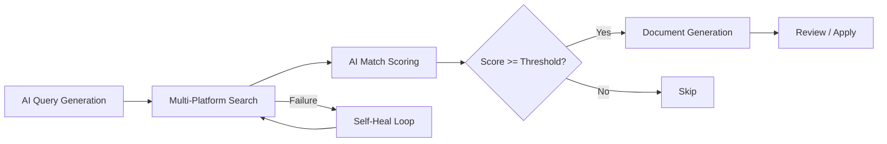
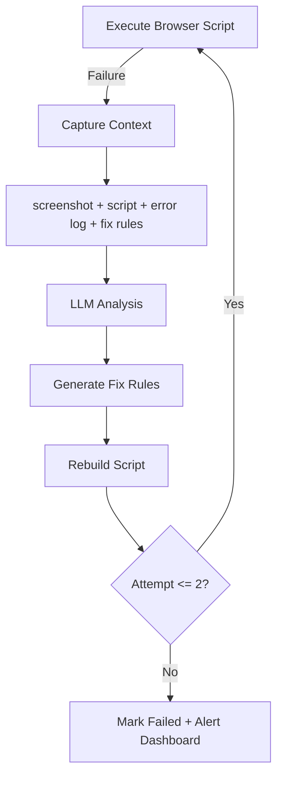

# Web3ToolBox — AI Agent Runtime Platform

> A desktop platform that provides browser execution, persistent memory, and shared tool capabilities for AI agents. Agents connect via a standard WebSocket protocol and operate real fingerprint browsers to automate complex web workflows.

## Platform Architecture

```
┌──────────────────────────────────────────────────────────────┐
│                    AI Agents (WebSocket Protocol)             │
│  ┌─────────────────────┐  ┌─────────────────────┐           │
│  │   Job Seek Agent    │  │   Future Agent...   │           │
│  │ Search·Match·Gen    │  │                     │           │
│  └─────────┬───────────┘  └─────────┬───────────┘           │
└────────────┼────────────────────────┼────────────────────────┘
             │ WebSocket Protocol     │
┌────────────▼────────────────────────▼────────────────────────┐
│                  ToolBox Platform (Electron)                  │
│                                                              │
│  ┌────────────────────────────────────────────────────────┐  │
│  │  Core Services                                         │  │
│  │  Express Backend (:30001) ─ Task Lifecycle · WS Hub    │  │
│  │  React Frontend  (:3000)  ─ Agent Workspace · Dashboard│  │
│  └────────────────────────────────────────────────────────┘  │
│                                                              │
│  ┌──────────────────┐ ┌──────────────────┐ ┌──────────────┐ │
│  │  Tool Service    │ │  Memory Layer    │ │  Browser     │ │
│  │  (:30004)        │ │  (:30002)        │ │  Runtime     │ │
│  │  Browser Pool    │ │  SQLite (SoT)    │ │  Chromium    │ │
│  │  Screenshot      │ │  mem0 (Semantic) │ │  C++ Patches │ │
│  │  HTTP · Registry │ │  Scope Isolation │ │  Fingerprint │ │
│  └──────────────────┘ └──────────────────┘ └──────────────┘ │
└──────────────────────────────────────────────────────────────┘
```

The platform separates **infrastructure** from **application logic**. Each AI agent is a standalone Node.js process that connects to the platform via a [standardized WebSocket protocol](docs/ai-agent-protocol.md). The platform provides three foundational layers:

| Layer | Responsibility | Implementation |
|-------|---------------|----------------|
| **Browser Runtime** | Execute automation in real, fingerprint-consistent browsers | Customized Chromium with C++ Blink patches, per-environment isolation |
| **Memory** | Persist and recall knowledge across sessions | SQLite (structured SoT) + mem0 (semantic fuzzy recall), scoped per agent |
| **Tool Service** | Shared capabilities any agent can invoke | Browser pool, screenshot, HTTP proxy, tool registration/discovery |

## Agent Integration: WebSocket Protocol

Any AI agent can plug into the platform by implementing the [Agent WebSocket Protocol](docs/ai-agent-protocol.md):

```
Agent Process                          Platform Backend
    │                                       │
    │──── ws connect ──────────────────────→│
    │←─── agent_state_snapshot ────────────│  (full state sync)
    │──── agent_session_create ───────────→│
    │←─── agent_conversation_update ───────│  (prompts, questions)
    │──── agent_user_input ───────────────→│
    │←─── agent_subtask_update ────────────│  (progress)
    │←─── agent_artifact_update ───────────│  (generated outputs)
    │──── agent_execution_control ────────→│  (pause/resume/cancel)
    │                                       │
```

The protocol covers session management, structured conversations (options + free input + file upload), subtask progress, artifact delivery, and execution control — enabling the platform to render a universal Agent Workspace UI for any connected agent.

## Application: Job Seek Agent

The first agent built on the platform automates end-to-end job searching with AI-driven workflows.

### Workflow Engine



- **Multi-platform search** — Indeed, LinkedIn, Job Bank via fingerprint browsers (anti-bot aware)
- **AI match scoring** — LLM evaluates job-to-profile fit (60-100%), with user preference weighting
- **Document generation** — Tailored resume, cover letter, and interview prep per job, rendered as both downloadable artifacts and in-app structured preview
- **Self-healing pipeline** — On script failure: capture screenshot + error + context → LLM analysis → fix rule generation → script rebuild → retry (max 2 attempts)
- **Real-time dashboard** — SSE-driven UI with workflow progress, job listings, platform status, and document preview modals

### Self-Healing Loop



When a browser script fails (Cloudflare block, selector drift, modal popups), the system captures the full execution context and sends it to an LLM for diagnosis. Fix rules are persisted and reapplied on subsequent runs, turning each failure into a permanent improvement.

## Platform Deep Dives

### Browser Execution Runtime

The platform wraps a customized Chromium build with C++ patches to the Blink engine:

- **Fingerprint injection** — Canvas, WebGL, audio context, navigator properties, client hints set per-environment for consistent browser identity
- **Worker context consistency** — Patched `navigator.languages` hooks across Web Worker / Service Worker / SharedWorker contexts to pass Cloudflare Turnstile (C++ Blink layer)
- **Environment isolation** — Each agent execution gets its own user data directory, proxy, timezone, geolocation, and WebRTC configuration
- **Anti-bot handling** — Runtime detection of debugger traps with domain-level memory for pre-injection on known hostile sites

### Memory Architecture

```
┌─────────────────────────────────────────────────┐
│  ┌──────────┐   ┌───────────┐   ┌────────────┐ │
│  │ State    │   │ Knowledge │   │ Semantic   │ │
│  │ (Hot)    │ → │ (SQLite)  │ → │ (mem0)     │ │
│  │ In-memory│   │ SoT       │   │ Fuzzy      │ │
│  └──────────┘   └───────────┘   └────────────┘ │
│       ↑               ↑               ↑        │
│       └─── scope: agent:<name> ────────┘        │
└─────────────────────────────────────────────────┘
```

- **Hot state** — Sub-millisecond reads for active session data
- **SQLite** — Structured knowledge store (profiles, job history, preferences), source of truth
- **mem0** — Semantic recall via embeddings, fuzzy search over past interactions
- **Marker protocol** — Agents update structured memory inline during conversation: `[PROFILE_SET:skills=React, Node.js]`
- **Scope isolation** — Each agent operates in its own memory namespace

### Multi-Agent Development System

The platform itself is developed using a role-based multi-agent workflow:

- **Coordinator** dispatches tasks with conflict detection and priority scheduling
- **Dev agents** implement features in isolated git worktrees with parallel execution
- **Tester** runs Playwright regression suites (17 tests across API, unit, and Electron UI)
- **QA** performs real-environment visual verification via browser automation

This system is defined as portable markdown workflows, reusable across projects.

## Tech Stack

| Layer | Technologies |
|-------|-------------|
| **Desktop** | Electron, Node.js |
| **Frontend** | React 18, Zustand, React Bootstrap, SCSS, i18next |
| **Backend** | Express, express-ws, WebSocket, SSE |
| **AI/LLM** | OpenAI, Claude, Codex CLI — multi-provider with runtime switching |
| **Memory** | SQLite, mem0 (semantic embeddings), NeDB |
| **Browser** | Customized Chromium (C++ Blink patches), Playwright, Puppeteer |
| **Testing** | Playwright (E2E + Electron), Jest (unit) |
| **Languages** | JavaScript, C++, Python, TypeScript |

## Getting Started

```bash
git clone https://github.com/web3ToolBoxDev/toolBoxClient.git
cd toolBoxClient
yarn install                # install dependencies
yarn build                  # build React frontend
yarn dist                   # package Electron distributable (output in dist/)
```

Development mode: `yarn dev` starts Electron + backend. `yarn start` for React hot reload.

## Project Status

**Current: v1.3.0**

- Platform: fingerprint browser runtime, 3-layer memory, toolService, WebSocket agent protocol, task lifecycle management
- Job Seek Agent: multi-platform search, AI matching, document generation, self-healing pipeline, real-time dashboard, i18n
- Testing: 17-test regression suite (API + unit + Electron UI)
- Dev tooling: multi-agent coordination system (Coordinator → Dev → Tester → QA)

## License

Apache-2.0. See [LICENSE](LICENSE).
