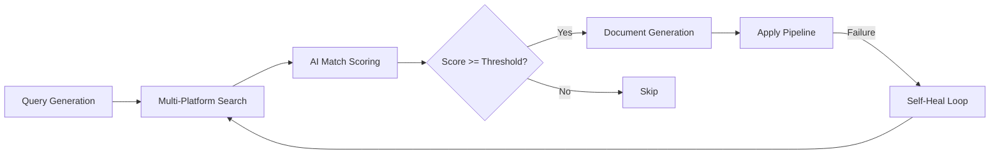
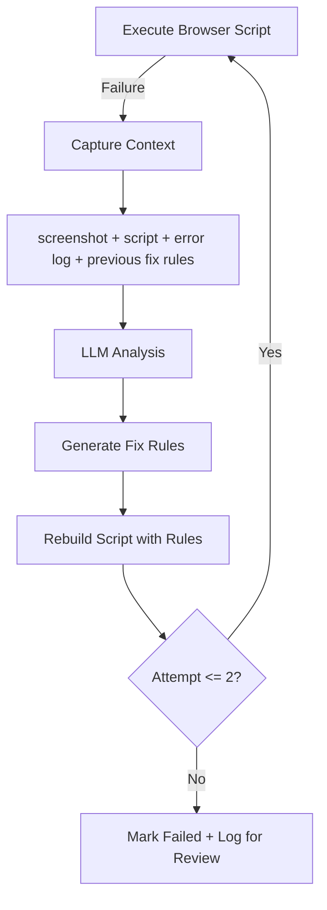

# Web3ToolBox — AI Agent Desktop Platform

> An Electron-based platform for building and running AI agents that operate real browsers, manage multi-stage workflows, and self-heal on failure.

## Architecture Overview

```
Electron Main (electron.js)
├── React Frontend (port 3000)
│   React 18, Zustand, i18next, React Bootstrap
├── Express Backend (port 30001)
│   REST API + WebSocket server, task lifecycle management
├── Dashboard Server (port 30003)
│   Per-agent SSE-driven real-time workflow UI
├── dbservice (port 30002)
│   SQLite structured knowledge + mem0 semantic memory
├── toolService (port 30004)
│   Shared browser automation and tool capabilities
└── Agent Runtime
    ├── searchPipeline.js — search orchestration + self-heal
    ├── scriptBuilder.js — LLM-generated browser scripts
    ├── dashboardServer.js — real-time dashboard + workflow UI
    └── workflow/ — step-based workflow engine
```

Five services coordinate through HTTP, WebSocket, and SSE. The Electron main process manages window lifecycle and spawns the backend. The React client communicates with the backend via Axios and WebSocket for real-time task updates. Agents execute in isolated child processes with access to fingerprint-aware browser instances.

## Key Features

- **Agent Workflow Engine** — Multi-stage pipelines (search, generate, apply) with step-level progress tracking, failure recovery, and conditional branching
- **Self-Healing Execution** — On script failure: capture screenshot + error log + script context, send to LLM for analysis, generate fix rules, rebuild script, retry (up to 2 attempts)
- **Browser Execution Runtime** — Fingerprint-aware Chromium with environment/wallet/session injection, proxy-geo-timezone-WebRTC consistency, and anti-bot handling
- **3-Layer Memory System** — Hot state cache for active sessions, SQLite for structured knowledge (source of truth), mem0 for semantic recall across conversations
- **Tool Platform** — Shared tools in toolService, domain-specific tools in vertical agents, runtime tool discovery and registration
- **Real-Time Communication** — WebSocket protocol with heartbeat, auto-reconnect with exponential backoff, message queuing during disconnects, and SSE for dashboard streaming
- **Multi-Language Support** — Full i18n (English + Chinese) across all UI surfaces including dynamically generated agent content

## System Design Highlights

### 1. Agent Workflow Engine



Workflows are defined as ordered steps, each with its own execution logic, success criteria, and failure handler. The engine tracks per-job progress, supports pause/resume, and persists state across restarts. A coordinator manages the pipeline lifecycle and routes failures to the self-healing subsystem.

### 2. Self-Healing Search Pipeline



When a browser automation script fails, the system captures the full execution context — including a page screenshot, the failing script, error logs, and any previously applied fix rules — and sends it to an LLM. The LLM produces targeted fix rules that are injected into the script builder for the next attempt. This closed-loop approach handles dynamic page changes, selector drift, and unexpected modal dialogs without manual intervention.

### 3. Memory Architecture

```
┌─────────────────────────────────────────────┐
│              Agent Runtime                  │
│                                             │
│  ┌──────────┐  ┌───────────┐  ┌──────────┐ │
│  │ State    │  │ Knowledge │  │ Semantic  │ │
│  │ (Hot)    │→ │ (SQLite)  │→ │ (mem0)   │ │
│  │ In-memory│  │ SoT       │  │ Fuzzy    │ │
│  └──────────┘  └───────────┘  └──────────┘ │
│       ↑              ↑              ↑       │
│       └── scope: agent:<name> ──────┘       │
└─────────────────────────────────────────────┘
```

Each agent operates in an isolated memory scope. Hot state serves the active session with sub-millisecond reads. SQLite stores structured knowledge (user profiles, job history, preferences) as the source of truth. mem0 provides semantic recall — fuzzy search over past interactions and decisions. A marker protocol (`[PROFILE_SET:section=value]`) allows agents to update structured memory inline during conversation.

### 4. Browser Execution Runtime

The platform wraps a customized Chromium build with C++ patches to the Blink engine. Key capabilities:

- **Fingerprint injection** — User agent, canvas, WebGL, audio context, and navigator properties are set per-environment to maintain consistent browser identity
- **Worker context patches** — Diagnosed and fixed Cloudflare Turnstile failures caused by incomplete `navigator.languages` hooks in Web Worker contexts (C++ Blink layer patch)
- **Environment isolation** — Each execution gets its own user data directory, proxy configuration, timezone, geolocation, and WebRTC settings
- **Anti-bot handling** — Runtime detection of debugger traps with automatic anti-debug script injection

### 5. Multi-Agent Development System

Development of the platform itself uses a role-based multi-agent system:

- **Coordinator** — Decomposes user requests into scoped tasks
- **PM** — Writes acceptance criteria and approves implementation plans
- **Dev** — Implements features with automated E2E verification
- **Tester** — Runs Playwright tests against the live application
- **QA** — Visual verification of dashboard state via screenshots

Agents coordinate through persistent task logs with conflict detection. The scrum workflow enforces plan-before-code discipline: no implementation begins before PM approval.

## Tech Stack

| Layer | Technologies |
|-------|-------------|
| **Desktop** | Electron, Node.js |
| **Frontend** | React 18, Zustand, React Bootstrap, SCSS, i18next |
| **Backend** | Express, express-ws, WebSocket, SSE |
| **AI/LLM** | OpenAI, Claude, Codex CLI integration |
| **Memory** | SQLite, mem0 (semantic), NeDB (legacy) |
| **Browser** | Customized Chromium (C++ patches), Playwright, Puppeteer |
| **Infrastructure** | Docker, CI/CD, Redis |
| **Languages** | JavaScript, Python, C++, TypeScript, Solidity |

## Getting Started

```bash
git clone https://github.com/web3ToolBoxDev/toolBoxClient.git
cd toolBoxClient
yarn install                # install dependencies
yarn build                  # build React frontend
yarn dist                   # package Electron distributable (output in dist/)
```

For development mode: `yarn dev` starts Electron + backend with hot reload on port 3000.

## Project Status

**Current version: v1.2.0**

Completed: agent workflow engine, self-healing pipeline, multi-platform search (Indeed/LinkedIn/Job Bank), AI match scoring, document generation (resume/cover letter/interview prep), real-time dashboard, fingerprint browser runtime, 3-layer memory system, i18n, WebSocket communication layer.

In progress (v1.3.0): workflow-level retry redesign, pipeline timeout handling, memory persistence improvements.

## License

Apache-2.0. See [LICENSE](LICENSE).
